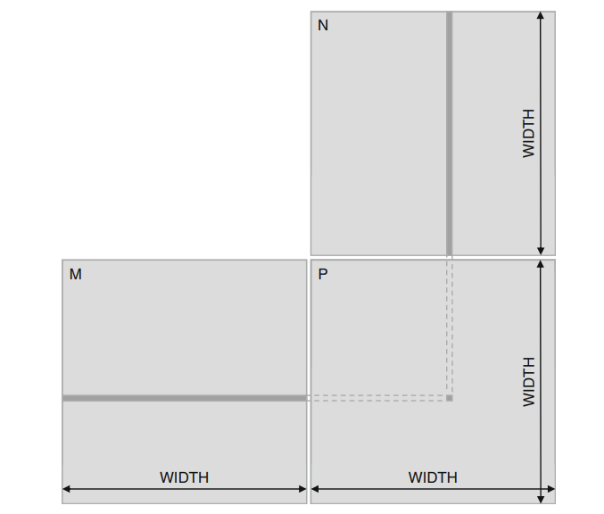

# Matrix Multiplication with CUDA

Source: [`matmul.cu`](matmul.cu)

## Overview

This project implements GPU-accelerated matrix multiplication. Given two matrices:

Given two matrices:

$$
A \in \mathbb{R}^{M \times N},
\qquad
B \in \mathbb{R}^{N \times K}
$$

their matrix product is:

$$
C = A \times B
$$

where:

$$
C \in \mathbb{R}^{M \times K}
$$

Each element of $C$ is computed as the dot product of a row of $A$ and a column of $B$:

$$
C_{row,col}
=
\sum_{i=0}^{N-1}
A_{row,i} \cdot B_{i,col}
$$

## Implementation

- `A` has shape $32 \times 32$.
- `B` has shape $32 \times 32$.
- `C` has shape $32 \times 32$.
- Host memory is allocated with `malloc`; device memory is allocated with `cudaMalloc`.
- The inputs are initialized with reproducible pseudo-random values using seed `42`.
- The launch configuration is a $2 \times 2$ grid of $16 \times 16$ blocks.
- Each thread computes one element of `C`.
- The result is copied back to the host and printed by `validateResult`.

## Observations

- Each output element is an independent dot product, so output elements can be computed in parallel.
- A thread computes one output element using the linearized expression:
  `sum += A[row * N + i] * B[i * K + col]`.
- For one output element, the naive kernel performs $N$ multiplications, $N-1$ additions, reads $2N$ input values, and writes one output value.
- Counting a multiply and an addition as two floating-point operations, the arithmetic intensity is approximately:
  $$
  \frac{2N}{8N + 4}\ \text{FLOPs/byte}
  $$
  because each `float` uses 4 bytes. Solving the limit as $N \to \infty$:
  $$
  \lim_{N \to \infty} \frac{2N}{8N + 4}
  = \lim_{N \to \infty} \frac{2}{8 + \frac{4}{N}}
  = \frac{2}{8}
  = 0.25\ \text{FLOPs/byte}
  $$
  Therefore, the kernel has low arithmetic intensity and is likely memory-bound.
- This kernel repeatedly loads values from global memory. A tiled implementation could load reusable matrix tiles into shared memory and reduce redundant global-memory traffic.

## Validation

`validateResult` prints the complete $32 \times 32$ result matrix after the device computation finishes. The current function is a display helper rather than a numerical correctness check because it does not compare the GPU result with a CPU reference result.
